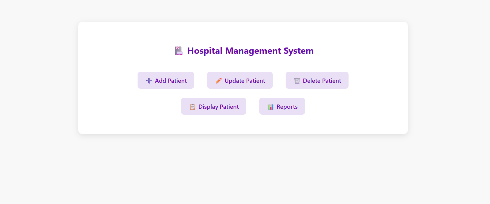
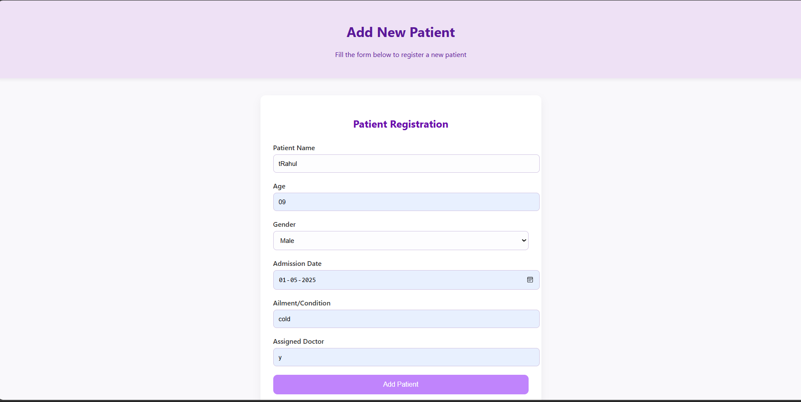
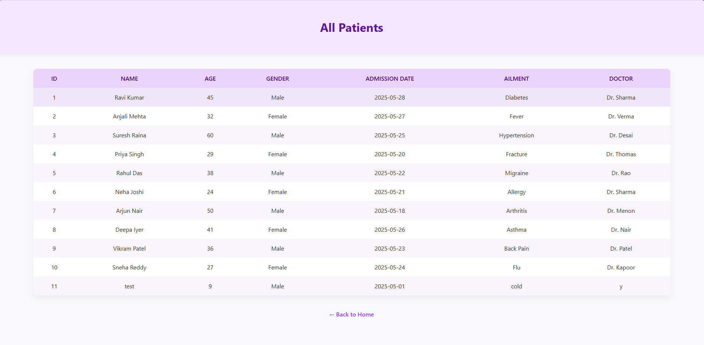
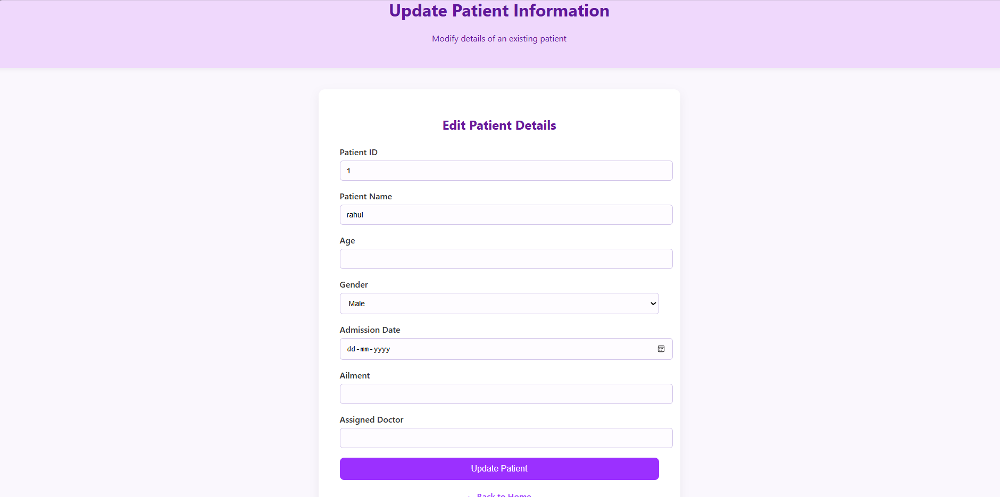
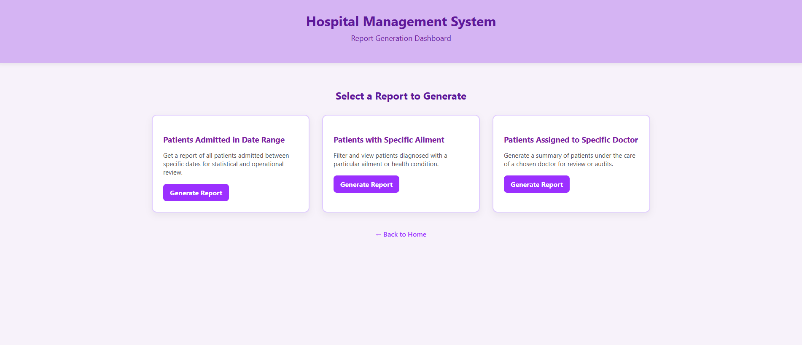

# **Hospital Management System**

**Subject Name**: Advanced Java  
**Subject Code**: BCS613D  
**Name**: Rahul s koti   
**USN**: 4AL22CS113  
**Sem/Section**: VI/B

A comprehensive web application for managing hospital operations including patient records, doctor management, appointments, and medical reports built with JSP, Servlets, and MySQL following MVC architecture principles.

## 🚀 Features

* **Patient Management**: Complete CRUD operations for patient records
* **Doctor Management**: Add, update, delete, and manage doctor information
* **Appointment Scheduling**: Book, modify, and cancel patient appointments
* **Medical Records**: Maintain patient medical history and treatment records
* **Advanced Search**: Search patients by ID, name, or contact information
* **Comprehensive Reports**: Generate various reports including:
   * Patient records by date range
   * Doctor schedules and availability
   * Appointment statistics
   * Patient treatment history
   * Department-wise patient distribution
* **Input Validation**: Client-side and server-side validation
* **Professional UI**: Bootstrap-based responsive design
* **MVC Architecture**: Clean separation of concerns
* **Database Integration**: MySQL with JDBC connectivity
* **Role-based Access**: Different access levels for administrators and staff

## 📋 Prerequisites

Before running this application, make sure you have the following installed:

* **Java Development Kit (JDK) 8 or higher**
* **Apache Tomcat 9.0 or higher**
* **MySQL Server 5.7 or XAMPP Server**
* **MySQL JDBC Driver (mysql-connector-java)**
* **IDE**: Eclipse (J2EE), IntelliJ IDEA, or any Java IDE
* **Web Browser**: Chrome, Firefox, or Edge

## 🛠️ Project Structure

```
HospitalManagementApp/
├── src/
│   ├── dao/
│   │   ├── PatientDAO.java
│   │   ├── DoctorDAO.java
│   │   ├── AppointmentDAO.java
│   │   └── MedicalRecordDAO.java
│   ├── model/
│   │   ├── Patient.java
│   │   ├── Doctor.java
│   │   ├── Appointment.java
│   │   └── MedicalRecord.java
│   └── servlet/
│       ├── PatientServlet.java
│       ├── DoctorServlet.java
│       ├── AppointmentServlet.java
│       ├── MedicalRecordServlet.java
│       ├── ReportServlet.java
│       └── SearchServlet.java
├── WebContent/
│   ├── index.jsp
│   ├── patient/
│   │   ├── add_patient.jsp
│   │   ├── update_patient.jsp
│   │   ├── view_patients.jsp
│   │   └── patient_details.jsp
│   ├── doctor/
│   │   ├── add_doctor.jsp
│   │   ├── update_doctor.jsp
│   │   ├── view_doctors.jsp
│   │   └── doctor_profile.jsp
│   ├── appointment/
│   │   ├── book_appointment.jsp
│   │   ├── view_appointments.jsp
│   │   └── appointment_calendar.jsp
│   ├── reports/
│   │   ├── report_dashboard.jsp
│   │   ├── patient_reports.jsp
│   │   └── appointment_reports.jsp
│   └── common/
│       ├── header.jsp
│       ├── footer.jsp
│       └── navigation.jsp
├── WEB-INF/
│   └── web.xml
└── README.md
```

## 🗄️ Database Setup

### 1. Create Database

```sql
CREATE DATABASE IF NOT EXISTS hospital_management;
USE hospital_management;
```

### 2. Create Tables

```sql
-- Patients Table
CREATE TABLE IF NOT EXISTS patients (
    patient_id INT PRIMARY KEY AUTO_INCREMENT,
    first_name VARCHAR(50) NOT NULL,
    last_name VARCHAR(50) NOT NULL,
    date_of_birth DATE NOT NULL,
    gender ENUM('Male', 'Female', 'Other') NOT NULL,
    phone VARCHAR(15) NOT NULL,
    email VARCHAR(100),
    address TEXT,
    emergency_contact VARCHAR(15),
    blood_group VARCHAR(5),
    registration_date TIMESTAMP DEFAULT CURRENT_TIMESTAMP
);

-- Doctors Table
CREATE TABLE IF NOT EXISTS doctors (
    doctor_id INT PRIMARY KEY AUTO_INCREMENT,
    first_name VARCHAR(50) NOT NULL,
    last_name VARCHAR(50) NOT NULL,
    specialization VARCHAR(100) NOT NULL,
    phone VARCHAR(15) NOT NULL,
    email VARCHAR(100) NOT NULL,
    department VARCHAR(50),
    qualification VARCHAR(200),
    experience_years INT,
    consultation_fee DECIMAL(10,2),
    joining_date DATE
);

-- Appointments Table
CREATE TABLE IF NOT EXISTS appointments (
    appointment_id INT PRIMARY KEY AUTO_INCREMENT,
    patient_id INT,
    doctor_id INT,
    appointment_date DATE NOT NULL,
    appointment_time TIME NOT NULL,
    status ENUM('Scheduled', 'Completed', 'Cancelled') DEFAULT 'Scheduled',
    reason TEXT,
    created_at TIMESTAMP DEFAULT CURRENT_TIMESTAMP,
    FOREIGN KEY (patient_id) REFERENCES patients(patient_id),
    FOREIGN KEY (doctor_id) REFERENCES doctors(doctor_id)
);

-- Medical Records Table
CREATE TABLE IF NOT EXISTS medical_records (
    record_id INT PRIMARY KEY AUTO_INCREMENT,
    patient_id INT,
    doctor_id INT,
    visit_date DATE NOT NULL,
    diagnosis TEXT,
    treatment TEXT,
    prescription TEXT,
    notes TEXT,
    follow_up_date DATE,
    created_at TIMESTAMP DEFAULT CURRENT_TIMESTAMP,
    FOREIGN KEY (patient_id) REFERENCES patients(patient_id),
    FOREIGN KEY (doctor_id) REFERENCES doctors(doctor_id)
);
```

### 3. Insert Sample Data

```sql
-- Sample Patients
INSERT INTO patients VALUES 
(1001, 'Rahul', 'koti', '1995-05-15', 'Male', '9876543210', 'koti@email.com', 'Mangalore, Karnataka', '9876543211', 'O+', NOW()),
(1002, 'Priya', 'Sharma', '1988-08-22', 'Female', '9876543212', 'priya@email.com', 'Bangalore, Karnataka', '9876543213', 'A+', NOW()),
(1003, 'Rajesh', 'Kumar', '1975-12-10', 'Male', '9876543214', 'rajesh@email.com', 'Mumbai, Maharashtra', '9876543215', 'B+', NOW());

-- Sample Doctors
INSERT INTO doctors VALUES 
(2001, 'Dr. Arun', 'Patel', 'Cardiology', '9876543220', 'arun@hospital.com', 'Cardiology', 'MD Cardiology', 15, 1500.00, '2010-01-15'),
(2002, 'Dr. Sunita', 'Reddy', 'Pediatrics', '9876543221', 'sunita@hospital.com', 'Pediatrics', 'MD Pediatrics', 12, 1200.00, '2012-03-20'),
(2003, 'Dr. Vikram', 'Singh', 'Orthopedics', '9876543222', 'vikram@hospital.com', 'Orthopedics', 'MS Orthopedics', 18, 1800.00, '2008-06-10');

-- Sample Appointments
INSERT INTO appointments VALUES 
(3001, 1001, 2001, '2025-06-01', '10:00:00', 'Scheduled', 'Regular checkup', NOW()),
(3002, 1002, 2002, '2025-06-02', '11:30:00', 'Scheduled', 'Child vaccination', NOW()),
(3003, 1003, 2003, '2025-06-03', '14:00:00', 'Scheduled', 'Knee pain consultation', NOW());
```

## ⚙️ Installation & Setup

### Step 1: Clone/Download the Project
Download all the project files and organize them according to the project structure above.

### Step 2: Database Configuration
1. Start your MySQL server
2. Run the database setup scripts provided above
3. Update database credentials in all DAO classes:

```java
connection = DriverManager.getConnection(
    "jdbc:mysql://localhost:3306/hospital_management", 
    "your_username", 
    "your_password");
```

### Step 3: Add MySQL JDBC Driver
1. Download MySQL Connector/J from the official MySQL website
2. Add the JAR file to your project's `WEB-INF/lib` directory
3. If using an IDE, add it to your build path

### Step 4: Deploy to Tomcat
1. Create a new Dynamic Web Project in your IDE
2. Copy all source files to the appropriate folders
3. Deploy the project to Tomcat server
4. Start the Tomcat server

### Step 5: Access the Application
Open your web browser and navigate to:
```
http://localhost:8080/HospitalManagementApp/
```

## 🏥 Application Modules

### Patient Management
- Register new patients with complete details
- Update patient information
- View patient records and history
- Search patients by various criteria

### Doctor Management
- Add doctor profiles with specializations
- Manage doctor schedules and availability
- Update doctor information
- View department-wise doctor lists

### Appointment System
- Book appointments with available doctors
- View appointment calendar
- Reschedule or cancel appointments
- Track appointment status

### Medical Records
- Maintain patient treatment history
- Record diagnoses and prescriptions
- Track follow-up appointments
- Generate medical reports

### Reports & Analytics
- Patient registration trends
- Doctor utilization reports
- Appointment statistics
- Revenue reports
- Department-wise analysis

## 🔧 Configuration

### Database Connection Properties
Update the following properties in your DAO classes:
- **Database URL**: `jdbc:mysql://localhost:3306/hospital_management`
- **Username**: Your MySQL username
- **Password**: Your MySQL password

### Server Configuration
- **Default Port**: 8080
- **Context Path**: `/HospitalManagementApp`
- **Session Timeout**: 30 minutes

## 📱 Usage

2. **Patient Registration**: Register new patients with complete medical information
3. **Appointment Booking**: Schedule appointments with available doctors
4. **Medical Records**: Maintain and update patient medical history
5. **Generate Reports**: Create various analytical reports for management


### Dashboard

Main dashboard showing payroll overview and quick access to all modules

### Employee Management

Employee registration form with comprehensive details


Complete employee directory with search and filter options

### Salary Structure

Salary component configuration interface

### Reports Dashboard

Comprehensive salary and payroll analytics
## 🤝 Contributing

1. Fork the project
2. Create your feature branch (`git checkout -b feature/AmazingFeature`)
3. Commit your changes (`git commit -m 'Add some AmazingFeature'`)
4. Push to the branch (`git push origin feature/AmazingFeature`)
5. Open a Pull Request


## 📞 Contact

**Rahul s koti**   
- USN: 4AL22CS113

## 🙏 Acknowledgments

- Thanks to the Advanced Java course instructors
- Bootstrap for the responsive UI framework
- MySQL for the robust database system
- Apache Tomcat for the web server
